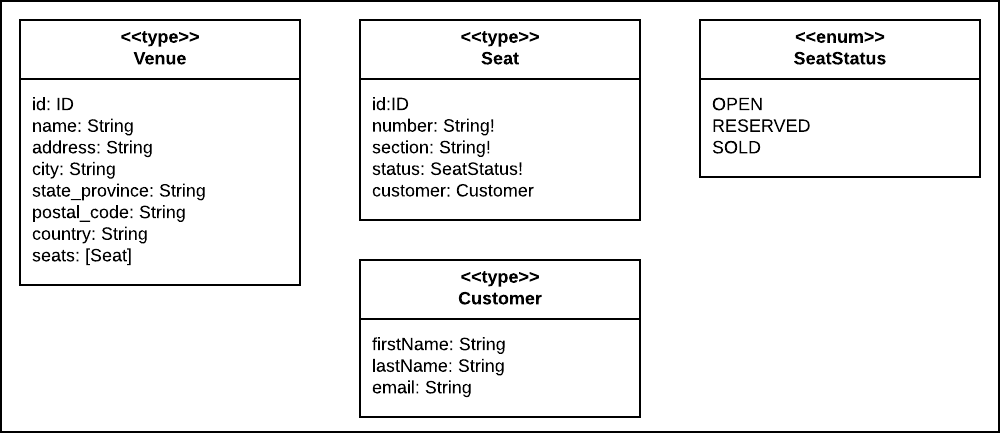
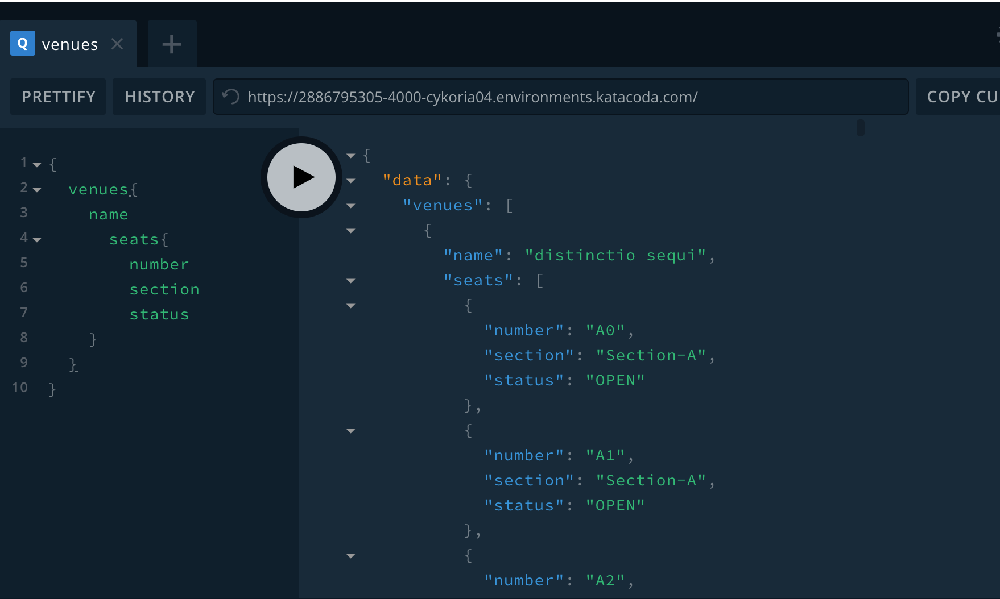

# Seat Saver

Seat Saver is a project that demonstrates how to implement high volume message streaming under GraphQL.

Seat Saver in an GraphQL API that provides seat reservations services. The API exposes a set of types that describe seats in a venue, as shown in the figure below:



The Seat Saver API allows developers to reserve and then buy a seat in within a given venue. Also, the Seat Saver API publishes a set of subscriptions that provides streams of messages according to events. These events are:

* `onSeatReserved`
* `onSeatSold`
* `onSeatReleased`

**NOTE:** Seat Saver will automatically inject preliminary seed data into the datastore upon startup. This seed data describes 3 venues with each venue having a number of seats accordingly.

There are two ways to get the Seat Save project up and running. One way is to use a Docker Compose installation on a single host machine. The Docker Compose installation will install an instance of MongoDB and Redis as containers on the host machine.

The second way is to install seat saver as a standalone application on the host. This method requires configuring Seat Saver with references to running instances of MongoDB and Redis. These instances can be out on the internet or on an internal network. The references to MongoDB and Redis are defined their URLs. Typically these URLs will container username/password information.

These URLS need to be assigned to specific environment variables on the host machine(s) where Seat Saver is running.

The environment variable for the MongoDB reference is:

`MONGODB_URL`

The environment variables for the Redis reference are:

`MESSAGE_BROKER_HOST`

`MESSAGE_BROKER_PORT` (optional)

The sections that follow decribe how to setup Seat Saver as an application running under Docker Componse as well as running Seat Saver as a standalone application with references to MongoDB and Redis.

Also, there are sections that follow that provide examples for working with GraphQL `queries`, `mutations` and `subscriptions` in the Seat Saver API.


## Running Seat Saver as a Docker Compose Application

(You can run this project under a Katabcoda Ubuntu Playground. Click [here](https://katacoda.com/courses/ubuntu/playground) to
go to eh Ubuntu Playground.)

**Step 1:** Clone the source into your host machine.

`git clone https://github.com/reselbob/seat-saver`

**Step 2:** Go to the project directory

`cd seat-saver`

**Step 3:** Spin up the `docker-compose` project

`docker-compose up`

Seat saver will be running on port `4000`.



## Running Seat Saver as a Standalone Application

TO BE PROVIDED

### Dependency services requires
* MongoDB
* Redis

#### Setting the environment variable `MONGODB_URL`

#### Setting Redis environment variables

**Setting `MESSAGE_BROKER_HOST`**

**Setting `MESSAGE_BROKER_PORT`** (optional)

## Working with the Seat Saver API

### Venue

```graphql
    type Venue {
        id: ID
        name: String
        address: String
        city: String
        state_province: String
        postal_code: String
        country: String
        seats: [Seat]
    }
```

### Seat

```graphql
  type Seat {
        id:ID
        number: String!
        section: String!
        status: SeatStatus!
        customer: Customer
    }
```

```graphql
    type Customer {
        firstName: String
        lastName: String
        email: String
    }
```

## Subscriptions and Mutations

### Reserving a Seat

Sample common query variable

```json
{
  "seat": {
    "venueId": "5dce2cabba1d1d320106525a",
    "number": "A0",
    "customer": {
      "firstName": "Gonzalo",
  		"lastName": "Considine",
  		"email": "Gonzalo.Considine@dagmar.name" 
    }
  }
}
```
----

**reserveSeat**

```graphql
mutation reserveSeat($seat: SeatInput!) {
  reserveSeat(seat: $seat) {
  	id
    number
    section
    status 
  }
}
```

Output

```json
{
  "data": {
    "reserveSeat": {
      "id": "5dce2cabba1d1d320106525b",
      "number": "A0",
      "section": "Section-A",
      "status": "RESERVED"
    }
  }
}
```
----

**onSeatReserved**

```graphql
subscription onSeatReserved{
  onSeatReserved{
    venueId
    message
    number
    section
    status
    seatId  
  }
}
```

Output

```json
{
  "data": {
    "onSeatReserved": {
      "venueId": "5dce2cabba1d1d320106525a",
      "message": "Reserving Seat",
      "number": "A0",
      "section": null,
      "status": "RESERVED",
      "seatId": null
    }
  }
}
```

### Buying a Seat

**buySeat**

```graphql
mutation buySeat($seat: SeatInput!) {
  buySeat(seat: $seat) {
  	id
    number
    section
    status 
  }
}
```

Output

```json
{
  "data": {
    "buySeat": {
      "id": "5dce2cabba1d1d320106525b",
      "number": "A0",
      "section": "Section-A",
      "status": "SOLD"
    }
  }
}
```
----
**onSeatSold**

```graphql
subscription onSeatSold{
  onSeatSold{
    venueId
    message
    number
    section
    status
    seatId
  }
}
```

Output

```json
{
  "data": {
    "onSeatSold": {
      "venueId": "5dce2cabba1d1d320106525a",
      "message": "Bought Seat",
      "number": "A0",
      "section": "Section-A",
      "status": "SOLD",
      "seatId": "5dce2cabba1d1d320106525b"
    }
  }
}

```
### Releasing a Seat

**releaseSeat**

```graphql
mutation releaseSeat($seat: SeatInput!) {
  releaseSeat(seat: $seat) {
  	id
    number
    section
    status 
  }
}
```

Output

```json
{
  "data": {
    "releaseSeat": {
      "id": "5dce2cabba1d1d320106525b",
      "number": "A0",
      "section": "Section-A",
      "status": "OPEN"
    }
  }
}
```

----
**onSeatReleased**

```graphql
subscription onSeatReleased{
  onSeatReleased{
    venueId
    message
    number
    section
    status
    seatId

  }
}
```

Output

```json
{
  "data": {
    "onSeatReleased": {
      "venueId": "5dce2cabba1d1d320106525a",
      "message": "Released Seat",
      "number": "A0",
      "section": "Section-A",
      "status": "OPEN",
      "seatId": "5dce2cabba1d1d320106525b"
    }
  }
}
```